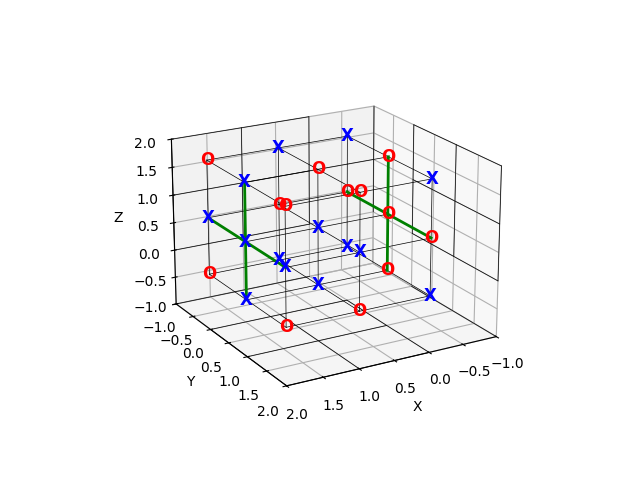

I have difficulty thinking in 3D space
======================================

Our `Jupyter Notebook Modeling Examples <https://www.gurobi.com/jupyter_models/>`__
page contains an example called: `Logic Programming - 3D Tic-Tac-Toe <https://www.gurobi.com/jupyter_models/logic-programming-3d-tic-tac-toe/>`__.
This example comes from a well know textbook, Model Building in Mathematical Programming by H. Paul Williams.

The problem is to find an arrangment of X's and O's in a 3-dimensional tic-tac-toe grid such that the number of completed lines (of either X's or O's) is minimized.
Even though the problem is quite easy for a human to understand, we found it difficult for our Custom GPT, despite the fact that its training data contains solutions to this exact model. We found the results to be inconsistent, sometimes yielding the correct answer, but more often, yielding a wrong answer.

Even when the model yielded the correct answer, we often found the generated model or its justification to be unsatifactory.

.. tabs::

   .. tab:: Prompt

      .. literalinclude:: content/tic_tac_toe.txt
         :language: text

   .. tab:: Generated Model formulation

      .. include:: content/tic_tac_toe.rst

   .. tab:: Generated Python code

      .. literalinclude:: content/tic_tac_toe.py
         :language: python

In the above example results, both the Model formulation and Python code might initially look good, and the final answer produced by the generated code is correct.
However, if we look at the Line Completion Constraints defined in the Generated Model formulation, the text says that the provided linear constraints will ensure that the line completion variables (:math:`l_h^X` and :math:`l_h^O`) will be equal to one if and only if their corresponding line of X's or O's is completed.
However, the constraints provided only enforce that these variables must be one if the corresponding lines are completed but do not force them to zero if the lines are not completed.
Since we are minimizing the number of completed lines, these constraints, *together with the minimization objective*, will lead to a correct model, as the objective forces as many of these variables to zero as possible.

This may seem like a nitpick; however, we found that if we asked our Custom GPT to instead maximize the number of completed lines, instead of minimizing them, it would sometimes build a model that allows all of the line completion variables to be set to 1, leading to a clearly wrong result.

We also found that, depending on the prompt we used, whether for minimization or maximization, the Custom GPT often miscalculated the number of lines to be considered in this hypothetical :math:`3\times 3\times 3` tic-tac-toe board.
