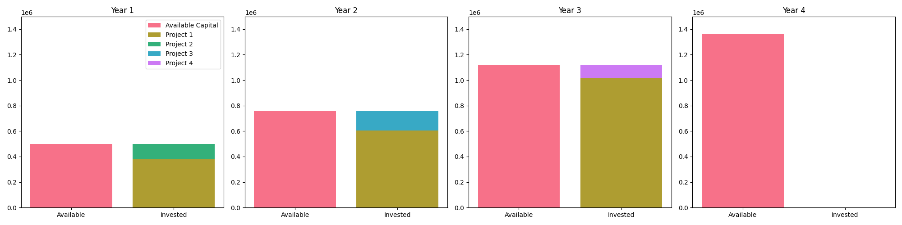

I don't know how to store inventory for later use
=================================================

Similar to the previous point, our experiments have found that the current generation LLMs find it
challenging to deal with specific problems that include multiple periods of time, where one period
accumulates something that rolls over to the next month.

Take for instance the following (partial) problem description:

.. code-block:: console

   An investor has a capital of $500,000 and has some investment projects to choose from in the coming 3 years.
   Amounts are invested at the start of the year once the investment duration has passed, the vested amount plus return rate is returned at the end of the year.

   ...

   Objective: Maximize the capital at the end of year 3

Intuitively, it should be easy to understand how this works: You invest in a program for 1 year. At the end of year 1
you get back your initial investment plus returns which become available to invest in the coming year.

We can run this premise many times, and only get back a correct model 30% of the time. What is interesting is that the
other 70% of incorrect models are wrong in so many different and subtle ways that it's not clear what in the prompt
is causing confusion.

Through some iterations we have managed to improve the prompt efficiency by:

1. explicitly stating how to model wealth accumulation (via intermediate variables), and
2. using terminology that is more consistent (solely mentioning wealth "at the start of the month" while removing the notion "at the end of the month").

This increased the ratio of correct models to around 75%.

.. tabs::

   .. tab:: Bad

      .. literalinclude:: content/investment_bad.txt
         :language: text

   .. tab:: Good

      .. literalinclude:: content/investment_good.txt
         :language: text

   .. tab:: Generated Model formulation

      .. include:: content/investment.rst

   .. tab:: Generated Python code

      .. literalinclude:: content/investment.py
         :language: python

