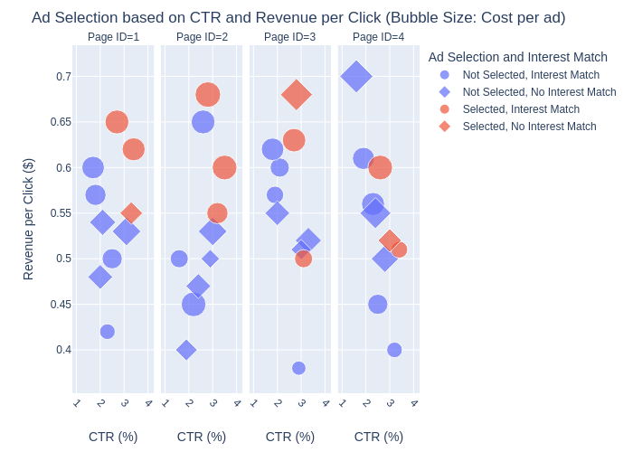
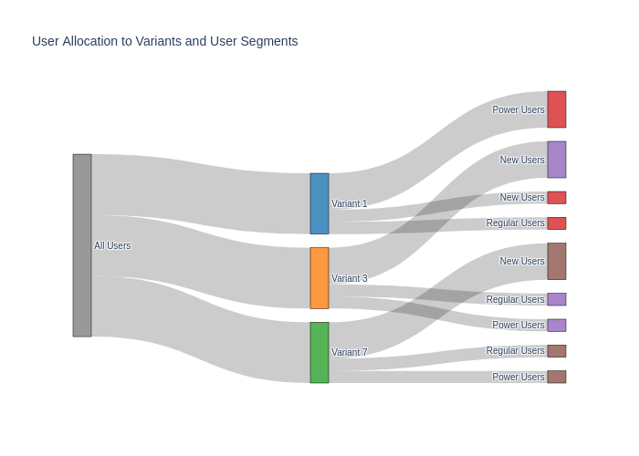
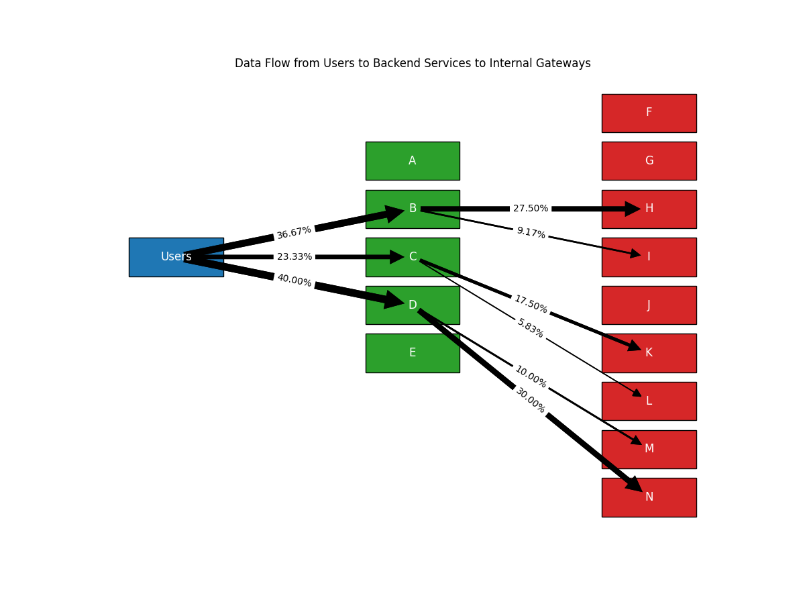
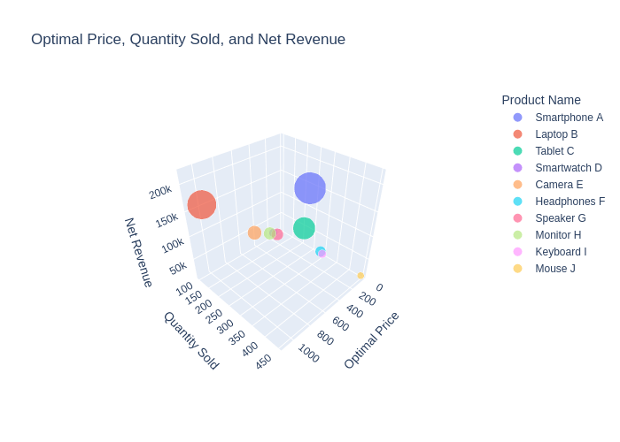

Backend Engineer
================

Ad Selection
------------

Select which ads should be run on your website to maximize revenue, taking into account the associated cost and user experience.

.. tabs::

   .. tab:: Prompt

      .. literalinclude:: content/backend_ad_selection.txt
         :language: text

   .. tab:: Data

      :download:`backend_ad_selection.csv: <content/backend_ad_selection.csv>`

      .. literalinclude:: content/backend_ad_selection.csv
         :language: text

   .. tab:: Example generated model

      .. literalinclude:: content/backend_ad_selection.py
         :language: python

A/B Testing
----------------------

Choose from a pool of A/B variants and allocate different user segments to them to minimize user disruption while
upholding statistical significance.

.. tabs::

   .. tab:: Prompt

      .. literalinclude:: content/backend_ab_testing.txt
         :language: text

   .. tab:: Data

      :download:`backend_ab_testing.csv: <content/backend_ab_testing.csv>`

      .. literalinclude:: content/backend_ab_testing.csv
         :language: text

   .. tab:: Example generated model

      .. literalinclude:: content/backend_ab_testing.py
         :language: python

Backend API Routing
-------------------

Route the network from end-users to first and second-degree internal servers, minimizing latency while maintaining low cost and a reliability SLA.

.. tabs::

   .. tab:: Prompt

      .. literalinclude:: content/backend_network_routing.txt
         :language: text

   .. tab:: Data

      :download:`backend_network_routing_backend.csv: <content/backend_network_routing_backend.csv>`

      .. literalinclude:: content/backend_network_routing_backend.csv
         :language: text

      :download:`backend_network_routing_internal.csv: <content/backend_network_routing_internal.csv>`

      .. literalinclude:: content/backend_network_routing_internal.csv
         :language: text

   .. tab:: Example generated model

      .. literalinclude:: content/backend_network_routing.py
         :language: python

E-Commerce Pricing
-------------------

Determine the optimal sales price for the items on an E-commerce platform.

.. tabs::

   .. tab:: Prompt

      .. literalinclude:: content/backend_ecommerce.txt
         :language: text

   .. tab:: Data

      :download:`backend_ecommerce.csv: <content/backend_ecommerce.csv>`

      .. literalinclude:: content/backend_ecommerce.csv
         :language: text

   .. tab:: Example generated model

      .. literalinclude:: content/backend_ecommerce.py
         :language: python
