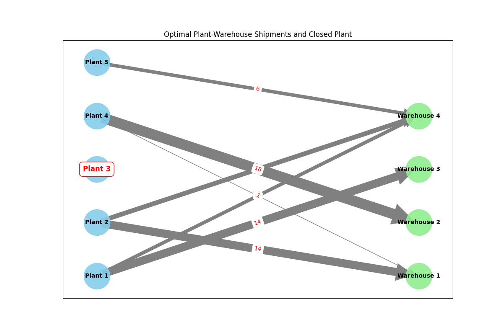
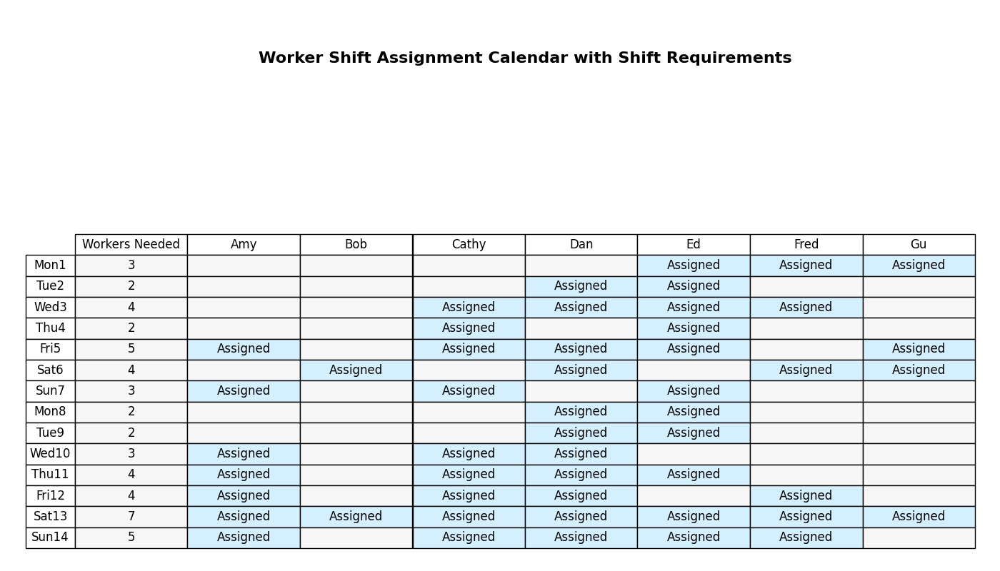
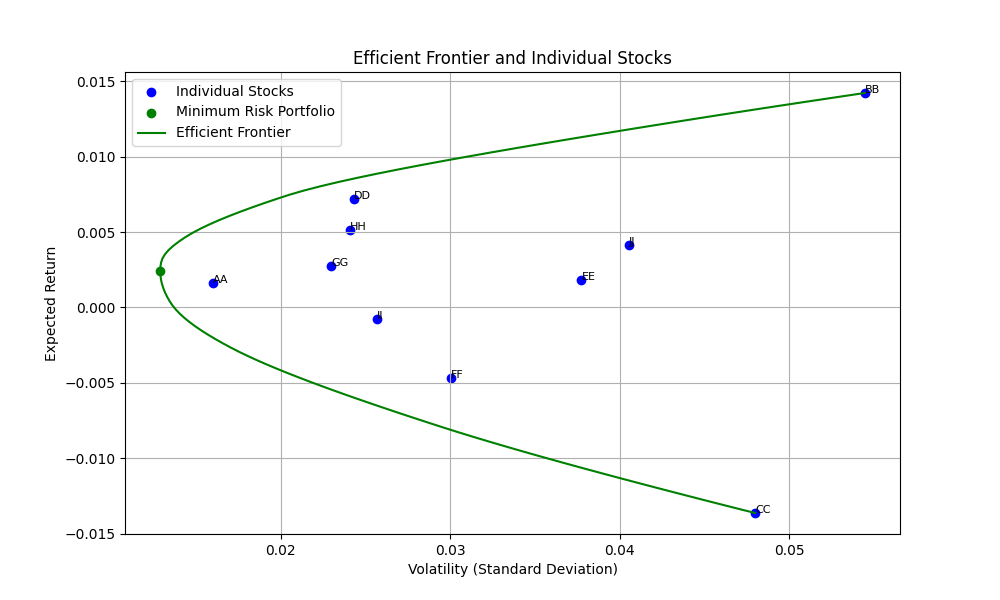

Classic OR Examples
===================

.. _classic_prompts:

The examples on this page are considered classic OR examples. Historically, we have published the code for these
examples on the `Examples <https://docs.gurobi.com/projects/examples/en/current/exampleview.html>`__ page in our
documentation.

For this AI modeling project, we have translated these models back into problem descriptions. Note that
the model generated by the LLM might not reflect Gurobi's best practices. For the best practices we recommend
looking at the model code in the `Examples <https://docs.gurobi.com/projects/examples/en/current/exampleview.html>`__
page.

Facility
----------------

Simple facility location model: given a set of plants and a set of warehouses, with transportation costs between them,
this example finds the least expensive set of plants to open in order to satisfy product demand.

The reference Python code showing Gurobi best practices can be found in our documentation
`here <https://docs.gurobi.com/projects/examples/en/current/examples/python/facility.html>`__.

.. tabs::

   .. tab:: Prompt

      .. literalinclude:: content/classic/facility.txt
         :language: text

   .. tab:: Data

      :download:`facility.csv: <content/classic/facility.csv>`

      .. literalinclude:: content/classic/facility.csv
         :language: text

   .. tab:: Generated Model formulation

      .. include:: content/classic/facility.rst

   .. tab:: Generated Python code

      .. literalinclude:: content/classic/facility.py
         :language: python

Diet
------------

Builds and solves the classic diet problem.

The reference Python code showing Gurobi best practices can be found in our documentation
`here <https://docs.gurobi.com/projects/examples/en/current/examples/python/diet.html>`__.

.. tabs::

   .. tab:: Prompt

      .. literalinclude:: content/classic/diet.txt
         :language: text

   .. tab:: Data

      :download:`diet.csv: <content/classic/diet.csv>`

      .. literalinclude:: content/classic/diet.csv
         :language: text

   .. tab:: Generated Model formulation

      .. include:: content/classic/diet.rst

   .. tab:: Generated Python code

      .. literalinclude:: content/classic/diet.py
         :language: python

Sudoku
------

A simple sudoku solving problem.

The reference Python code showing Gurobi best practices can be found in our documentation
`here <https://docs.gurobi.com/projects/examples/en/current/examples/python/sudoku.html>`__.

.. tabs::

   .. tab:: Prompt

      .. literalinclude:: content/classic/sudoku.txt
         :language: text

   .. tab:: Generated Model formulation

      .. include:: content/classic/sudoku.rst

   .. tab:: Generated Python code

      .. literalinclude:: content/classic/sudoku.py
         :language: python

Workforce
---------

Assigning workers optimally to fit a work schedule.

The reference Python code showing Gurobi best practices can be found in our documentation
`here <https://docs.gurobi.com/projects/examples/en/current/examples/python/workforce1.html>`__.

We have also described this use-case in our OptiMods toolbox, which is a convenient data-driven API for running
particular problem types like this one! See the
`Workforce Scheduling <https://gurobi-optimods.readthedocs.io/en/stable/mods/workforce.html>`__ or
`OptiMods <https://gurobi-optimods.readthedocs.io/en/stable/index.html>`__  to learn more.

.. tabs::

   .. tab:: Prompt

      .. literalinclude:: content/classic/workforce.txt
         :language: text

   .. tab:: Generated Model formulation

      .. include:: content/classic/workforce.rst

   .. tab:: Generated Python code

      .. literalinclude:: content/classic/workforce.py
         :language: python

.. _portfolio:

Portfolio Optimization
----------------------

This example solves a financial portfolio optimization model, using historical return data.

The reference Python code showing Gurobi best practices can be found in our documentation
`here <https://docs.gurobi.com/projects/examples/en/current/examples/python/portfolio.html>`__.

.. tabs::

   .. tab:: Prompt

      .. literalinclude:: content/classic/portfolio.txt
         :language: text

   .. tab:: Data

      :download:`portfolio.csv: <content/classic/portfolio.csv>`

      .. literalinclude:: content/classic/portfolio.csv
         :language: text

   .. tab:: Generated Model formulation

      .. include:: content/classic/portfolio.rst

   .. tab:: Generated Python code

      .. literalinclude:: content/classic/portfolio.py
         :language: python
