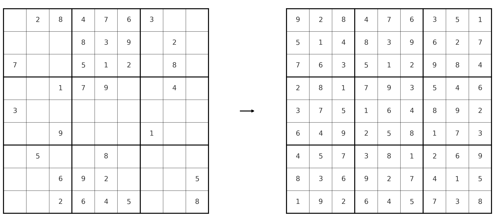

Classic OR Examples
===================

The examples on this page are considered classic OR examples. Historically, we have published the code for these
examples on the `Examples <https://docs.gurobi.com/projects/examples/en/current/exampleview.html>`__ page in our
documentation.

For this AI modelling project, we have translated these models back into problem descriptions. Note that
the model generated by the LLM might not reflect Gurobi's best practices. For the best practices we recommend
looking at the model code in the `Examples <https://docs.gurobi.com/projects/examples/en/current/exampleview.html>`__
page.

.. _portfolio:

Portfolio Optimization
----------------------

This example solves a financial portfolio optimization model, using historical return data.

The reference Python code showing Gurobi best practices can be found in our documentation
`here <https://docs.gurobi.com/projects/examples/en/current/examples/python/portfolio.html>`__.

.. image:: images/classic_portfolio.png
   :alt: Portfolio Optimization
   :align: center

.. tabs::

   .. tab:: Prompt

      .. literalinclude:: content/classic_portfolio.txt
         :language: text

   .. tab:: Data

      .. literalinclude:: content/classic_portfolio.csv
         :language: text

   .. tab:: Example generated model

      .. literalinclude:: content/classic_portfolio.py
         :language: python

Sudoku
------

A simple sudoku solving problem.

The reference Python code showing Gurobi best practices can be found in our documentation
`here <https://docs.gurobi.com/projects/examples/en/current/examples/python/sudoku.html>`__.

.. tabs::

   .. tab:: Prompt

      .. literalinclude:: content/classic_sudoku.txt
         :language: text

   .. tab:: Example generated model

      .. literalinclude:: content/classic_sudoku.py
         :language: python

Diet
------------

Builds and solves the classic diet problem.

The reference Python code showing Gurobi best practices can be found in our documentation
`here <https://docs.gurobi.com/projects/examples/en/current/examples/python/diet.html>`__.

.. tabs::

   .. tab:: Prompt

      .. literalinclude:: content/classic_diet.txt
         :language: text

   .. tab:: Example generated model

      .. literalinclude:: content/classic_diet.py
         :language: python

Facility
----------------

Simple facility location model: given a set of plants and a set of warehouses, with transportation costs between them,
this example finds the least expensive set of plants to open in order to satisfy product demand.

The reference Python code showing Gurobi best practices can be found in our documentation
`here <https://docs.gurobi.com/projects/examples/en/current/examples/python/facility.html>`__.

.. image:: images/classic_facility.png
   :alt: Facility
   :align: center

.. tabs::

   .. tab:: Prompt

      .. literalinclude:: content/classic_facility.txt
         :language: text

   .. tab:: Example generated model

      .. literalinclude:: content/classic_facility.py
         :language: python
