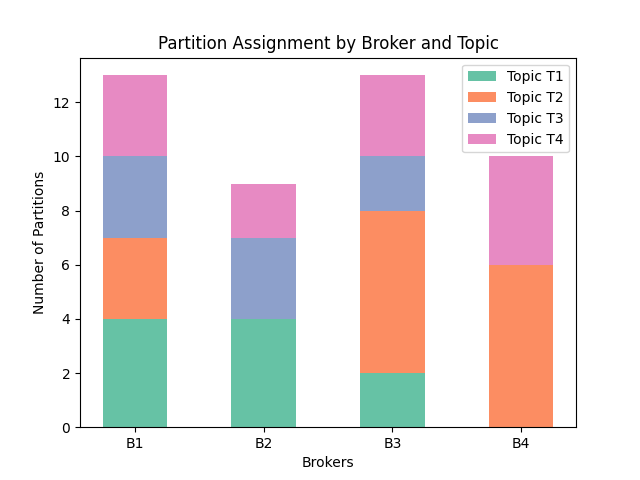

Data Engineer
=================

Apache Kafka Partition assignments
----------------------------------

Optimize the performance of the Apache Kafka cluster by smartly assigning Topic partitions to the various brokers.
The goal is to minimize the latency between the different brokers (for, for instance, replication or election workloads)
while dividing the partitions somewhat evenly over the different brokers.

.. tabs::

   .. tab:: Prompt

      .. literalinclude:: content/data/kafka.txt
         :language: text

   .. tab:: Data

      :download:`kafka_brokers.csv: <content/data/kafka_brokers.csv>`

      .. literalinclude:: content/data/kafka_brokers.csv
         :language: text

      :download:`kafka_topics.csv: <content/data/kafka_topics.csv>`

      .. literalinclude:: content/data/kafka_topics.csv
         :language: text

      :download:`kafka_rates.csv: <content/data/kafka_rates.csv>`

      .. literalinclude:: content/data/kafka_rates.csv
         :language: text

   .. tab:: Generated Model formulation

      .. include:: content/data/kafka.rst

   .. tab:: Generated Python code

      .. literalinclude:: content/data/kafka.py
         :language: python

Snowflake Optimizing clustering keys
------------------------------------

.. tabs::

   .. tab:: Prompt

      .. literalinclude:: content/data/snowflake.txt
         :language: text

   .. tab:: Data

      :download:`snowflake.csv: <content/data/snowflake.csv>`

      .. literalinclude:: content/data/snowflake.csv
         :language: text

   .. tab:: Generated Model formulation

      .. include:: content/data/snowflake.rst

   .. tab:: Generated Python code

      .. literalinclude:: content/data/snowflake.py
         :language: python
