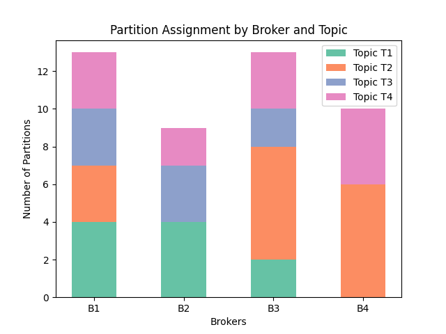

Data Engineer
=================

Apache Kafka Partition assignments
----------------------------------

Optimize the performance of the Apache Kafka cluster by smartly assigning Topic partitions to the various brokers.
The goal is to minimize the latency between the different brokers (for, for instance, replication or election workloads)
while dividing the partitions somewhat evenly over the different brokers.

.. tabs::

   .. tab:: Prompt

      .. literalinclude:: content/data_engineer_kafka.txt
         :language: text

   .. tab:: Data

      :download:`data_engineer_kafka_brokers.csv: <content/data_engineer_kafka_brokers.csv>`

      .. literalinclude:: content/data_engineer_kafka_brokers.csv
         :language: text

      :download:`data_engineer_kafka_topics.csv: <content/data_engineer_kafka_topics.csv>`

      .. literalinclude:: content/data_engineer_kafka_topics.csv
         :language: text

      :download:`data_engineer_kafka_rates.csv: <content/data_engineer_kafka_rates.csv>`

      .. literalinclude:: content/data_engineer_kafka_rates.csv
         :language: text

   .. tab:: Example generated model

      .. literalinclude:: content/data_engineer_kafka.py
         :language: python

A software engineer can leverage mathematical optimization to streamline complex decision-making and enhance system performance in various practical applications. By implementing optimization algorithms, engineers can efficiently solve problems like resource allocation, scheduling, and logistics. For instance, in cloud computing, optimization models can minimize operational costs by dynamically adjusting server loads based on demand. In supply chain management, these techniques can reduce transportation costs and improve delivery times by finding optimal routing paths. Optimization also plays a critical role in machine learning, where it aids in hyperparameter tuning, ensuring model accuracy and efficiency. By integrating mathematical optimization into their development workflow, software engineers can deliver solutions that are both cost-effective and high-performing across diverse domains.

**Data Partitioning and Sharding**: Determining the optimal strategy for partitioning and sharding large datasets across distributed systems to enhance query performance and maintain data consistency.

**Index Optimization**: Creating and maintaining the most efficient indexes for databases to enhance query performance without incurring significant overhead on write operations.
