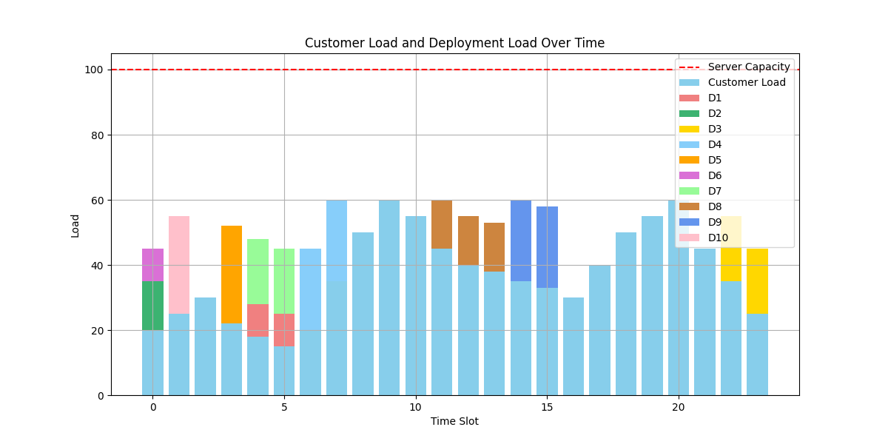
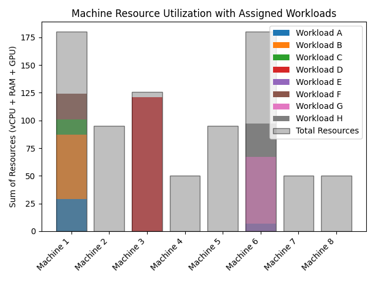
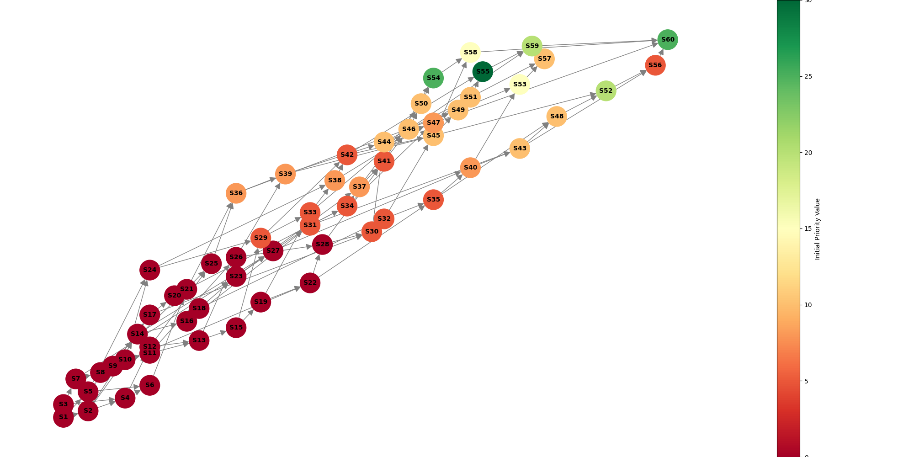
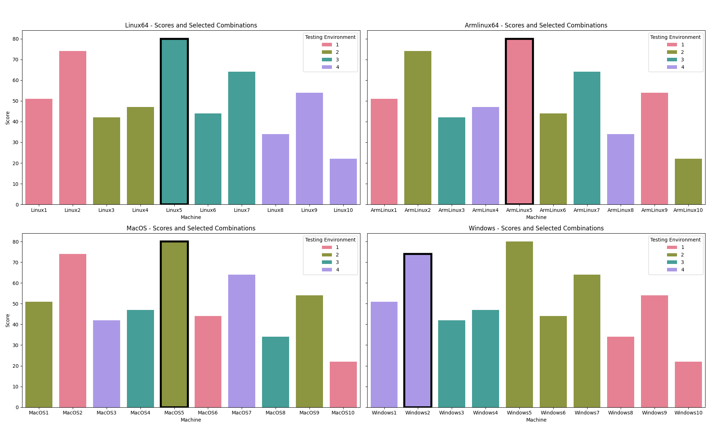

.. _examples_devops:

DevOps Engineer
===============

Scheduling deployments
----------------------

Schedule resource-heavy deployments on customer-facing hardware at low-traffic times so
that customers are least likely to be impacted.

.. tabs::

   .. tab:: Prompt

      .. literalinclude:: content/devops/scheduling_deployments.txt
         :language: text

   .. tab:: Data

      :download:`scheduling_deployments_base_load.csv: <content/devops/scheduling_deployments_base_load.csv>`

      .. literalinclude:: content/devops/scheduling_deployments_base_load.csv
         :language: text

      :download:`scheduling_deployments_deployments.csv: <content/devops/scheduling_deployments_deployments.csv>`

      .. literalinclude:: content/devops/scheduling_deployments_deployments.csv
         :language: text

   .. tab:: Generated Model formulation

      .. include:: content/devops/scheduling_deployments.rst

   .. tab:: Generated Python code

      .. literalinclude:: content/devops/scheduling_deployments.py
         :language: python

Assigning workloads
-------------------

Having a limited number of machines to schedule workloads on, assign the jobs so as to
minimize the number of machines impacted.

.. tabs::

   .. tab:: Prompt

      .. literalinclude:: content/devops/assigning_workloads.txt
         :language: text

   .. tab:: Data

      :download:`assigning_workloads_machines.csv: <content/devops/assigning_workloads_machines.csv>`

      .. literalinclude:: content/devops/assigning_workloads_machines.csv
         :language: text

      :download:`assigning_workloads_workloads.csv: <content/devops/assigning_workloads_workloads.csv>`

      .. literalinclude:: content/devops/assigning_workloads_workloads.csv
         :language: text

   .. tab:: Generated Model formulation

      .. include:: content/devops/assigning_workloads.rst

   .. tab:: Generated Python code

      .. literalinclude:: content/devops/assigning_workloads.py
         :language: python

.. _incident_response_planning:

Incident Response Planning
--------------------------

A complex system of internal and customer-facing services that have many interdependencies
should be brought online efficiently in case of a disaster. The customer-facing services
get assigned a priority value, determine the order in which the services should be brought
back online.

To induce urgency, we utilize the following formula that states that customer-facing services
should be brought online as quickly as possible, with more important services getting a higher priority:

:math:`V(t) = V_0 \cdot e^{-0.0398t}`

.. tabs::

   .. tab:: Prompt

      .. literalinclude:: content/devops/incident_response.txt
         :language: text

   .. tab:: Data

      :download:`incident_response.json: <content/devops/incident_response.json>`

      .. literalinclude:: content/devops/incident_response.json
         :language: json

   .. tab:: Generated Model formulation

      .. include:: content/devops/incident_response.rst

   .. tab:: Generated Python code

      .. literalinclude:: content/devops/incident_response.py
         :language: python

.. _testing_strategy:

Testing strategy optimization
-----------------------------

Smartly decide which machines to run tests on and what kind of testing environment to simulate.

.. tabs::

   .. tab:: Prompt

      .. literalinclude:: content/devops/testing_strategy.txt
         :language: text

   .. tab:: Data

      :download:`testing_strategy.csv: <content/devops/testing_strategy.csv>`

      .. literalinclude:: content/devops/testing_strategy.csv
         :language: text

   .. tab:: Generated Model formulation

      .. include:: content/devops/testing_strategy.rst

   .. tab:: Generated Python code

      .. literalinclude:: content/devops/testing_strategy.py
         :language: python

