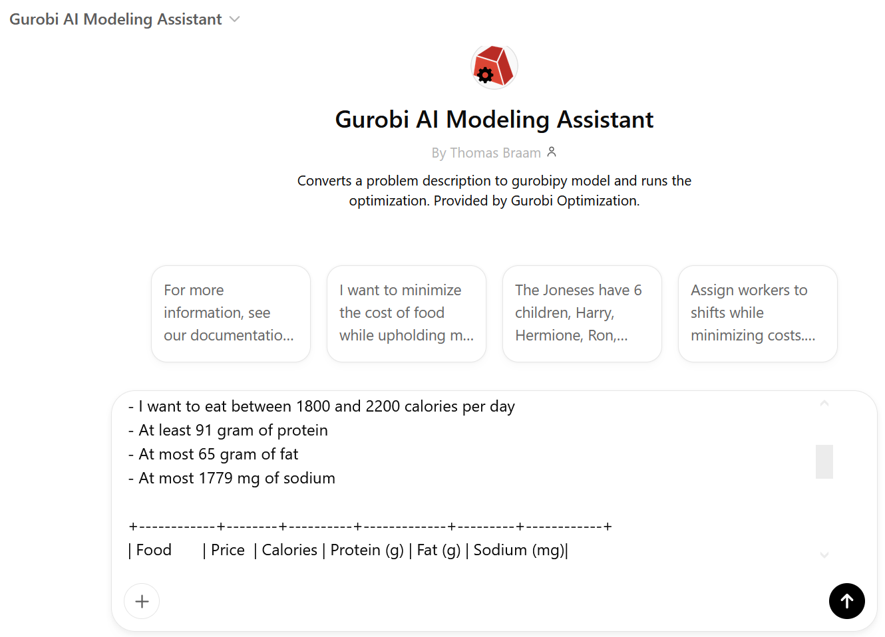
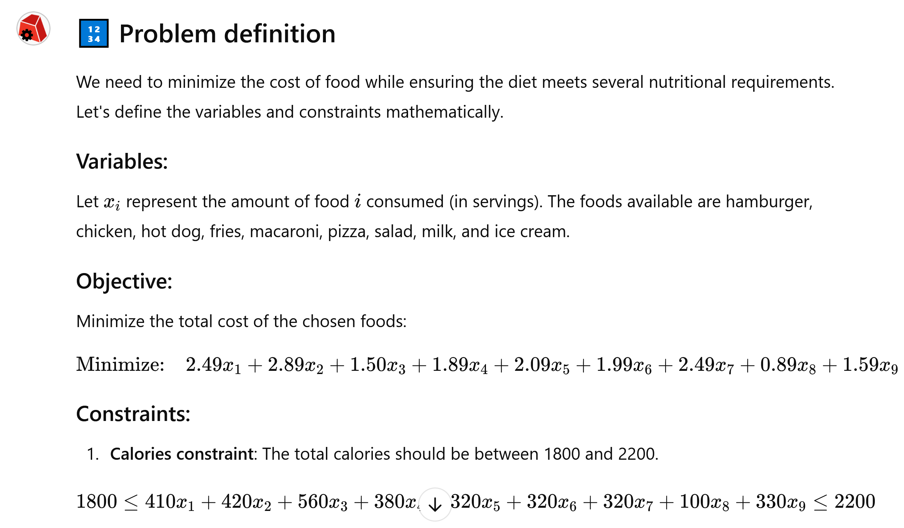
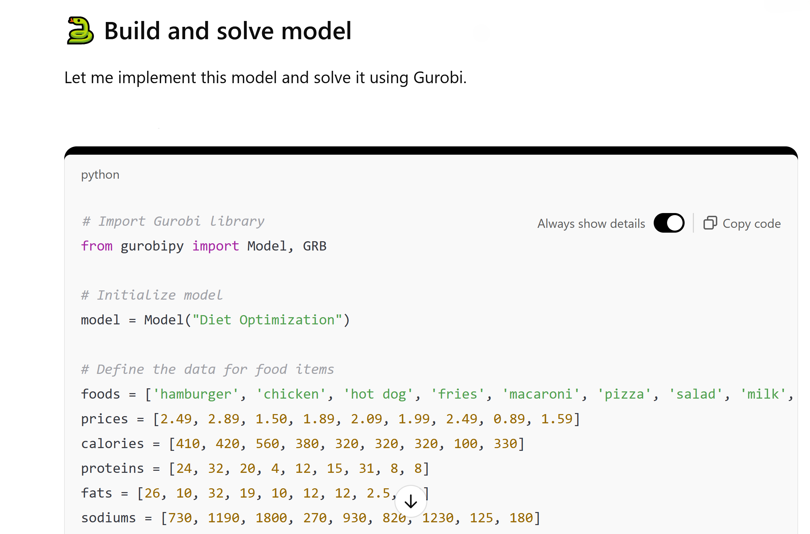
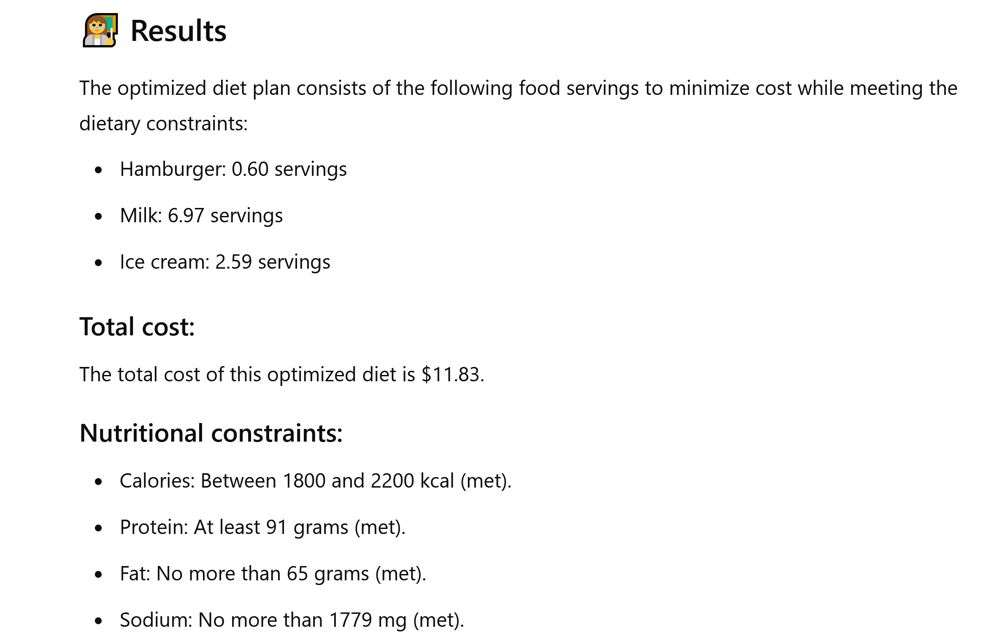

.. _getting_started:

Getting Started
===============

Take a look at the following dietary problem.

.. code-block:: text

    I want to optimize my diet.

    Objective: I want to minimize the cost of food while upholding my dietary needs.

    Constraints:
    - I want to eat between 1800 and 2200 calories per day
    - At least 91 gram of protein
    - At most 65 gram of fat
    - At most 1779 mg of sodium

Next, let's look at some of the foods we can buy at our local grocery store:

.. code-block:: text

    +------------+--------+----------+-------------+---------+------------+
    | Food       | Price  | Calories | Protein (g) | Fat (g) | Sodium (mg)|
    +------------+--------+----------+-------------+---------+------------+
    | hamburger  | 2.49   | 410      | 24          | 26      | 730        |
    | chicken    | 2.89   | 420      | 32          | 10      | 1190       |
    | hot dog    | 1.50   | 560      | 20          | 32      | 1800       |
    | fries      | 1.89   | 380      | 4           | 19      | 270        |
    | macaroni   | 2.09   | 320      | 12          | 10      | 930        |
    | pizza      | 1.99   | 320      | 15          | 12      | 820        |
    | salad      | 2.49   | 320      | 31          | 12      | 1230       |
    | milk       | 0.89   | 100      | 8           | 2.5     | 125        |
    | ice cream  | 1.59   | 330      | 8           | 10      | 180        |
    +------------+--------+----------+-------------+---------+------------+

This is not an easy problem to solve by hand. Think about how you would try to satisfy the dietary needs. If you somehow
managed to find a combination of ingredients by hand that fit the nutritional goals, how would you know that you are
spending as little money as possible?

This combination of an objective with constraints is called an **optimization problem** and is something that can be
represented mathematically and subsequently solved by optimization tools. Unfortunately, even though we can all
understand the problem that was described earlier, many of us do not have the magical power to translate this into a
mathematical representation.

However, with the advent of Generative AI, the power of optimization might be put into the hands of many more people.

Using ChatGPT as a translator for mathematics
---------------------------------------------

We have crafted a `Custom GPT <https://chatgpt.com/g/g-g69cy3XAp-gurobi-model-builder>`_ that helps with building and
solving an optimization model. Let's start by copying both the problem description and dataset we specified earlier and
paste it into the message box.

.. tip::

   Feel free to go ahead an try it yourself by heading to the `Custom GPT <https://chatgpt.com/g/g-g69cy3XAp-gurobi-model-builder>`_
   and changing either the constraints or the nutritional data and see how it influences the model and its results!

All of the following will now happen automatically in series, it first generates a mathematical model.

Then the Python code for the model is generated and optimized using Gurobi.

Finally, the solution is explained.

This was a quick walkthrough of the basic functionality of this project.

In the following chapters we will dive into the details on how to get started with modeling using LLMs. If you prefer
to skip ahead and experiment with other example prompts, you can also first head over to the :ref:`example_prompts` section.
